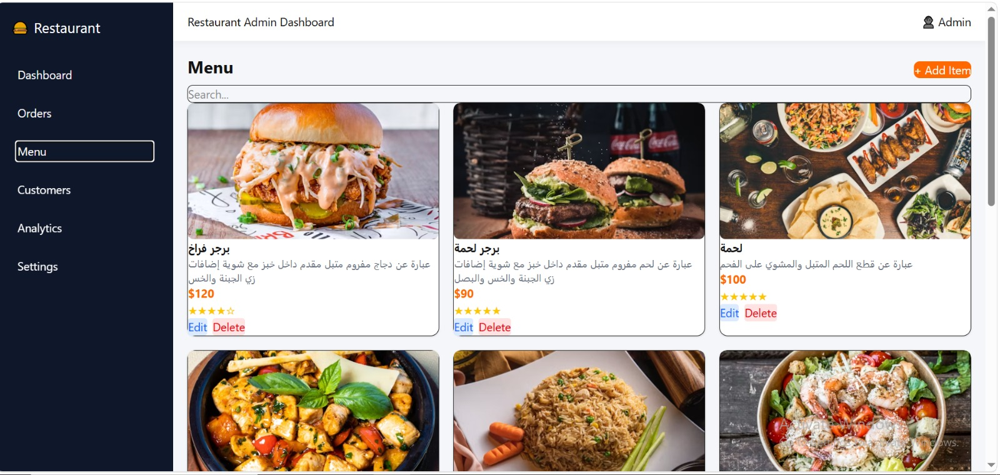

# 🍔 Restaurant Dashboard

A modern Restaurant Admin Dashboard built with React and Tailwind CSS.

## 📌 About The Project

Restaurant Dashboard is a front-end admin panel that helps restaurant owners manage their business data easily.

The dashboard provides different sections for:
- Orders management
- Menu management
- Customers tracking
- Analytics overview
- Settings

## 🚀 Features

- Responsive dashboard layout
- Sidebar navigation
- Navbar header
- Orders management with:
  - Search functionality
  - Filter by order status
  - Order status badges
  - Orders table
- Menu management
- Customers management
- Analytics page
- Clean and modern UI design

## 🛠️ Technologies Used

- React.js
- React Router DOM
- Tailwind CSS
- Vite
- JavaScript (ES6+)

## 📂 Project Structure
## 📸 Screenshots

